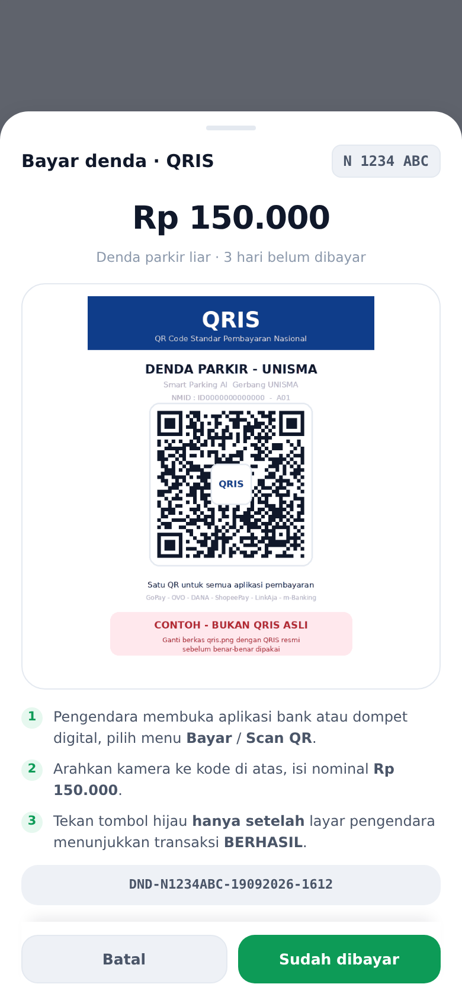
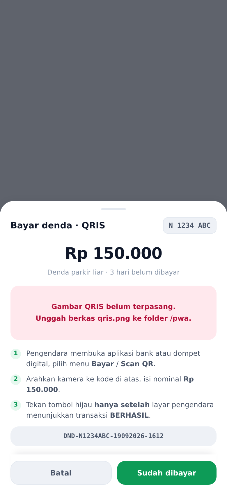

# QRIS untuk pembayaran denda parkir

Modal QRIS pada PWA petugas gerbang **Smart Parking AI UNISMA**
(<https://e-surat.unisma.ac.id/pwa/>).

Sebelumnya tombol **Bayar Denda** langsung memanggil `confirm()` — petugas
menerima uang tunai di gerbang, lalu menutup tagihan. Sekarang tombol itu
membuka lembar QRIS yang bisa ditunjukkan ke pengendara untuk dipindai.



## Berkas yang diubah di server

Semua perubahan ada di `~/e-surat.unisma.ac.id/public_html/pwa/`:

| Berkas | Perubahan |
|---|---|
| `index.html` | CSS lembar QRIS, markup modal, dan penulisan ulang penangan tombol bayar |
| `sw.js` | `VERSI` naik ke `spai-v20`, `./qris.png` masuk daftar pra-simpan |
| `qris.png` | **baru** — gambar QRIS (saat ini masih contoh) |

Cadangan `index.html` sebelum perubahan ada di server sebagai
`index.html.bak-qris-<tanggal>`.

Berkas `qris-modal.css`, `qris-modal.html`, dan `qris-modal.js` di repo ini
adalah salinan persis (byte-for-byte) dari tiga potongan yang disisipkan ke
`index.html`, dipisah supaya mudah dibaca dan ditinjau.

## Cara kerja

1. Petugas menekan **Bayar Denda** pada kartu pelanggaran.
2. Lembar QRIS naik dari bawah: plat, nominal tunggakan, kode QR, langkah
   singkat, dan nomor acuan.
3. Pengendara memindai dari HP-nya sendiri dan mengisi nominal.
4. Setelah layar pengendara menunjukkan transaksi **BERHASIL**, petugas
   menekan **Sudah dibayar** — barulah `POST /denda.php?aksi=bayar` dikirim,
   sama persis seperti alur lama.

**Catatan penting:** QRIS statis tidak mengabari aplikasi kalau uang sudah
masuk. Jadi yang menutup tagihan tetap penilaian petugas, bukan konfirmasi
dari bank — karena itu tombolnya dinamai "Sudah dibayar", bukan "Lunas".
Kalau nanti dipasang QRIS dinamis dengan callback, pengecekan otomatis itu
yang menggantikan tombol tersebut.

Nomor acuan (`DND-<PLAT>-<DDMMYYYY>-<HHMM>`) hanya ditampilkan di layar,
belum dikirim ke server — `api/denda.php` memang belum punya kolom untuk
metode pembayaran maupun nomor acuan. Kalau pencocokan mutasi mau dicatat
otomatis, kolom itu perlu ditambahkan dulu di sisi API.

## Mengganti QRIS contoh dengan yang asli

`qris.png` sekarang masih **contoh** — sengaja diberi tulisan
"CONTOH - BUKAN QRIS ASLI" supaya tidak terpakai tanpa sengaja.

Untuk menggantinya, timpa berkasnya:

```
~/e-surat.unisma.ac.id/public_html/pwa/qris.png
```

Lalu naikkan `VERSI` di `sw.js` (mis. `spai-v20` → `spai-v21`) supaya HP
petugas menarik gambar baru, bukan yang tersimpan di cache.

Anjuran untuk berkas penggantinya:

- PNG, lebar 500–800 px, latar putih polos
- kode QR memenuhi minimal setengah tinggi gambar
- ukuran berkas di bawah ~100 KB (dibuka di gerbang, sering sinyal seadanya)

Modal membatasi tinggi gambar ke `38dvh` dengan `object-fit: contain`, jadi
rasio berapa pun aman — tombol tidak akan terdorong keluar layar.

Kalau `qris.png` tidak ada, modal menampilkan peringatan merah, bukan kotak
putih kosong:



## Membuat ulang gambar contoh

```
pip install qrcode pillow
python3 buat-qris-contoh.py
```

Isi kodenya payload EMVCo berformat benar tapi dengan NMID dummy
(`ID0000000000000`) — tidak tertaut ke rekening mana pun.
